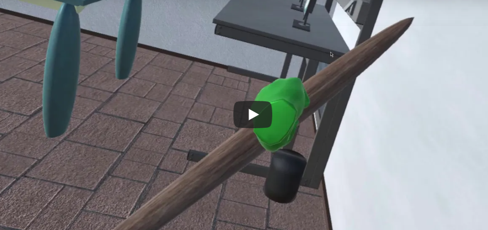

# VRscripts
C# scripts for the VR materials characterization lab. Learn a variety of material science concepts and operate the tools of a Material scientist as you learn.

A demonstration video can be found on [portfolium](https://portfolium.com/JosephTracey) with a [poster breaking down the various testing stations.](./Frontiers2020.pdf)

The full build can be found at: https://drive.google.com/drive/folders/14M8h-0pyK6cErIQPC5soAWYS9R3UKLHn?usp=sharing. Designed to work with the Oculus Rift VR headset, so functionality may vary with other headsets.
